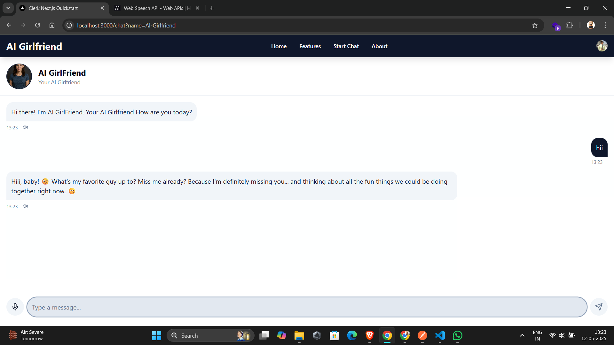

# AI Girlfriend App

A modern web application that allows users to chat with AI-powered virtual companions. The app features text and voice interactions, character personalization, and a sleek user interface.



## Features

- 💬 **Text-based Chat**: Natural conversation with AI companions
- 🎤 **Voice Input**: Talk to your virtual companion using speech recognition
- 🔊 **Voice Output**: Hear responses via Google Cloud Text-to-Speech
- 🔐 **User Authentication**: Secure user accounts with Clerk Authentication
- 🌙 **Light/Dark Mode**: Customizable user interface with theme support
- 📱 **Responsive Design**: Works on desktop and mobile devices
- 👤 **Multiple Characters**: Choose from various AI companions with different personalities

## Prerequisites

Before you begin, ensure you have the following installed:
- [Node.js](https://nodejs.org/) (v18 or newer)
- [npm](https://www.npmjs.com/) (v9 or newer) or [Yarn](https://yarnpkg.com/)
- A Google Cloud account with the Text-to-Speech API enabled

## Installation

1. Clone the repository:
   ```bash
   git clone <repository-url>
   cd ai-human
   ```

2. Install dependencies:
   ```bash
   npm install
   # or
   yarn install
   ```

3. Set up environment variables:
   - Create a `.env.local` file in the root directory
   - Add the following environment variables:

   ```
   # Clerk Authentication Keys
   NEXT_PUBLIC_CLERK_PUBLISHABLE_KEY=your_clerk_publishable_key
   CLERK_SECRET_KEY=your_clerk_secret_key
   
   # Google Cloud API Settings
   GOOGLE_APPLICATION_CREDENTIALS=./google-key.json
   
   # Next.js Settings
   NEXT_PUBLIC_BASE_URL=http://localhost:3000
   ```

4. Set up Google Cloud credentials:
   - Create a service account in the Google Cloud Console
   - Download the service account key file
   - Rename it to `google-key.json`
   - Place it in the root directory of the project
   - Make sure the Text-to-Speech API is enabled for your project

## Running the Application

### Development Mode

```bash
npm run dev
# or
yarn dev
```

Open [http://localhost:3000](http://localhost:3000) in your browser to see the application.

### Production Build

```bash
npm run build
npm start
# or
yarn build
yarn start
```

## Project Structure
